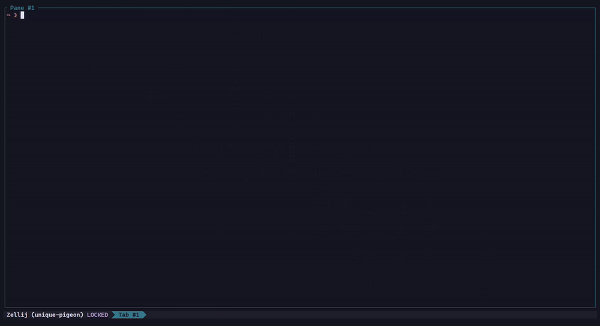

<h1 align="center" class="b">
  <br>
  lancher 🚀
  <br>
  <br>
</h1>

A minimal, local project-template manager written in Go.

<center>
  
</center>

`lancher` lets you organize and use project templates stored on your machine. You can register directories as templates, list them, and generate new projects from them. Templates can come from local paths or from git repositories (via HTTPS or SSH). Each template may include a `.lancher.yaml` file for metadata and post-creation hooks, allowing you to customize how new projects are initialized.

## Installation

Download and install the latest release with a single command:

```bash
curl -sS https://lancher.dev/install.sh | sh
```

The installer automatically detects your platform and downloads the appropriate pre-built binary.

<details>
<summary style="font-weight: bold">
Arch Linux
</summary>
<br />

```sh
yay -Sy lancher
```
</details>

<br/>

<details>
<summary style="font-weight: bold">
Debian/Ubuntu
</summary>
<br />

```sh
# Add the GPG public key
curl -fsSL https://lancher.dev/pubkey_KEYID.asc \
  | sudo gpg --dearmor -o /usr/share/keyrings/lancher.gpg

# Add the repository source
echo "deb [signed-by=/usr/share/keyrings/lancher.gpg] \
  https://repository.lancher.dev stable main" \
  | sudo tee /etc/apt/sources.list.d/lancher.list

# Install
sudo apt update && sudo apt install lancher
```
</details>


## Documentation

For detailed usage instructions, command reference, and advanced features, visit the official documentation at [lancher.dev/docs](https://lancher.dev/docs).

## Quick Start

```bash
# Create a new project (interactive mode)
lancher create

# Add a template from a git repository
lancher template add mytemplate https://github.com/user/template-repo

# List all templates
lancher template list

# Get help
lancher help
```

For more information and examples, visit [lancher.dev](https://lancher.dev).

## Contributing

Contributions are welcome! Whether you want to report bugs, request features, improve documentation, or contribute code, we appreciate your help.

To get started with local development, see [CONTRIBUTING.md](CONTRIBUTING.md) for detailed setup instructions and development workflow.

## License

lancher is released under the [MIT License](https://opensource.org/licenses/MIT)
